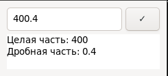

# educational-task-1

work for the laboratory assignment.



## Dependencies
- **GTK3**

## Build Instructions

1. **Clone the repository:**

   ```bash
   git clone https://github.com/onicue/educational-task-1
   cd repository
   ```
2. **Build with CMake**
   ```bash
   mkdir build
   cd build
   cmake ..
   cmake --build .
   ```
